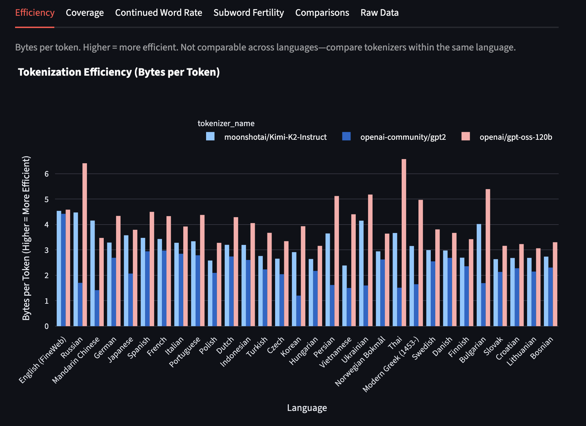

## Tokka-Bench

Benchmark and compare tokenizers across many languages using real FineWeb-2 and StarCoder data. Higher bytes/token = more efficient; higher unique tokens = better coverage.



👉 [Open the live Tokka-Bench dashboard](https://tokka-bench.streamlit.app/)

### TL;DR

- Any HuggingFace model or local tokenizer directory works
- Real streamed data, fast parallel execution
- Clean JSON results + interactive Streamlit dashboard

### Install

```bash
git clone <repository-url>
cd tokka-bench
uv sync
```

### Run a Benchmark

```bash
# Single tokenizer (2MB per language by default)
uv run benchmark tokenizer=openai-community/gpt2

# Multiple tokenizers in parallel
uv run benchmark tokenizers=openai-community/gpt2,meta-llama/Llama-3.1-8B max_workers=8

# Quick smoke test
uv run benchmark tokenizer=openai-community/gpt2 sample_size=0.1

# Custom output filename
uv run benchmark tokenizer=meta-llama/Meta-Llama-3-8B output_name=llama_results

# Example: comprehensive multi-tokenizer run
uv run benchmark tokenizer=openai-community/gpt2,google/gemma-3-27b-it,Xenova/gpt-4,meta-llama/Llama-3.1-8B,moonshotai/Kimi-K2-Instruct,Qwen/Qwen3-30B-A3B-Instruct-2507,openai/gpt-oss-120b max_workers=10
```

Results are saved to `data/results/{name}.json`.

### Visualize Results

```bash
# Recommended launcher (pre-flight checks)
uv run dashboard

# Or run Streamlit directly
uv run streamlit run streamlit_app.py
```

### Train Your Own Tokenizer (local) and Benchmark It

1. Train a tokenizer (e.g., with HuggingFace Tokenizers) and save it to a local folder, say `./my-tokenizer`.

2. Benchmark it by pointing to the folder:

```bash
uv run benchmark tokenizer=./my-tokenizer output_name=my_tokenizer
```

3. Launch the dashboard to compare with others:

```bash
uv run dashboard
```

Tips:

- You can control language counts: `natural_n=99 code_n=20`
- Adjust speed vs accuracy via `sample_size` (MB)

### What’s Measured

- **bytes_per_token**: higher = more efficient
- **unique_tokens**: higher = better script coverage
- **subword_fertility**: subwords per word/character unit
- **continued_word_rate**: % tokens that continue a word

### How It Works (one paragraph)

Tokka-Bench streams real text from FineWeb-2 (top N natural languages), FineWeb (English), and StarCoder (top N coding languages). It tokenizes equal-sized samples per language, computes metrics, aggregates global Unicode/script stats, and saves results in a simple JSON format for the dashboard.

### Troubleshooting

- Dashboard says no results: run a benchmark first to populate `data/results/`
- Using private/remote models: set `HF_TOKEN` in your environment
- Slow runs: lower `sample_size`, reduce `natural_n`/`code_n`, or increase `max_workers`

### Contributing

PRs welcome! See `CONTRIBUTING.md` for guidelines.

### License

MIT (or project license) — see LICENSE if provided.
